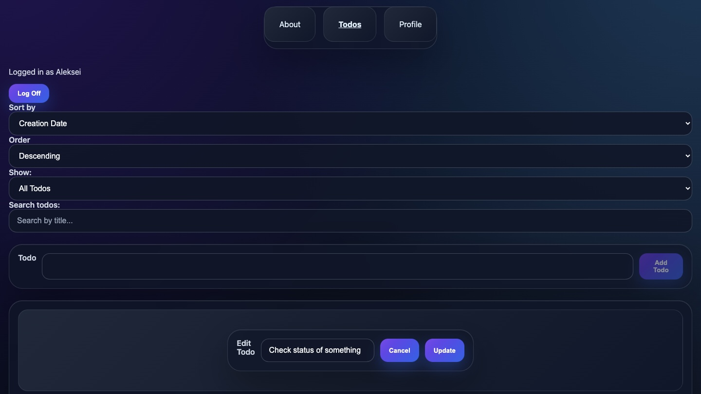

# Todo List Application

## Overview

A full-stack Todo List application built with React and Vite. The application allows users to create, edit, complete, delete, search, filter, and sort tasks through a clean and responsive interface.

## Live Demo

https://todo-list-perfect3.vercel.app

## GitHub Repository

https://github.com/MrPerfeccct/todo-list

## Features

* User authentication
* Protected routes
* Create new tasks
* Edit existing tasks
* Mark tasks as completed
* Delete tasks
* Search tasks
* Filter tasks by status
* Sort tasks by title or creation date
* Responsive design for desktop and mobile devices
* Input validation
* Input sanitization using DOMPurify
* Polished hover and focus states

## Technologies Used

* React
* React Router
* Vite
* JavaScript ES6+
* CSS
* DOMPurify
* REST API
* Vercel

## Screenshots

### Desktop



### Mobile


## Installation

Clone the repository:

```bash
git clone https://github.com/MrPerfeccct/todo-list.git
```

Navigate into the project:

```bash
cd todo-list
```

Install dependencies:

```bash
npm install
```

Start the development server:

```bash
npm run dev
```

Open the local URL displayed in the terminal.

## Build for Production

Create a production build:

```bash
npm run build
```

Preview the production build:

```bash
npm run preview
```

## Styling Approach

This project uses global CSS through `App.css`.

I chose this approach because the application is small, the styling is centralized, and the component structure is simple enough to avoid style conflicts. The CSS is organized by sections and includes responsive breakpoints, hover states, focus states, and custom checkbox styling to clearly show completed and active tasks.

## Design Decisions

* Dark modern UI with a consistent color scheme
* Simple navigation using React Router
* Reusable React components
* Reducer-based state management for todo actions
* Client-side validation for better user experience
* Sanitized user input for improved security
* Responsive layout for mobile and desktop screens
* Vercel configuration for production deployment

## Future Improvements

* Add unit tests for critical components
* Implement Progressive Web App features
* Add a dark/light theme toggle
* Improve task persistence with localStorage or backend API enhancements
* Add drag-and-drop functionality for reordering todos

## License

This project is licensed under the MIT License.

## Contact Information

GitHub: https://github.com/MrPerfeccct
Portfolio: https://mrperfeccct.github.io/My-portfolio/
Live Demo: https://todo-list-perfect3.vercel.app
